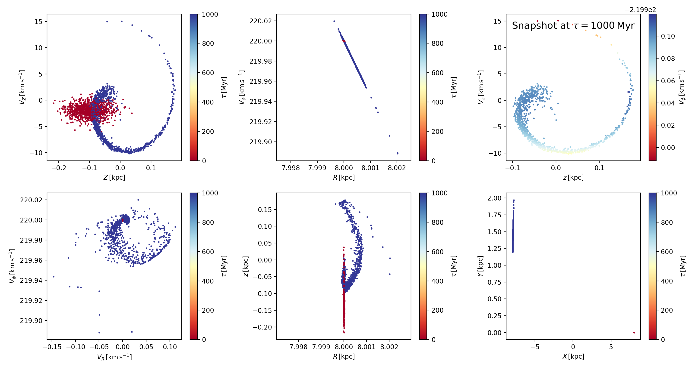

# GALAH_wrinkles
Following up the paper by Antoja+2018 (arXiv:1804.10196)

## toy model code in *z_vz_toy_model.ipynb*

Toy model used for example plot:

```python
new_toy_model = toy_model(
    nr_stars=1000, 
    potential=MWPotential2014,
    snapshots=np.linspace(0,1000,10),
    R_mean    =   8.,      R_disp    =   0.00001, # allowing to also perturb R
    vR_mean   =   0.,      vR_disp   =   0.00001, # allowing to also perturb vR
    vT_mean   = 220.,      vT_disp   =   0.00001, # allowing to also perturb vT
    z_mean    =  -0.1,      z_disp   =   0.04,    # Antoja+ -0.1, 0.04
    vz_mean   =  -2.,      vz_disp   =   1.,      # Antoja+ -2.0, 1.00
    phi_mean  =   0.,      phi_disp  =   0.00001  # allowing to also perturb phi
    )
```

## Example plot:


